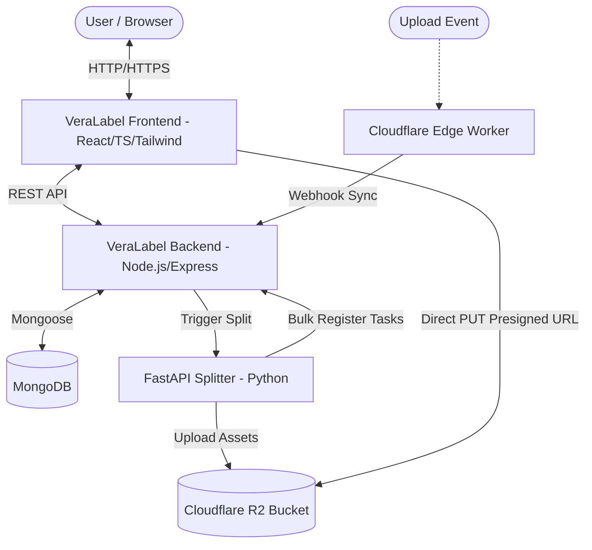
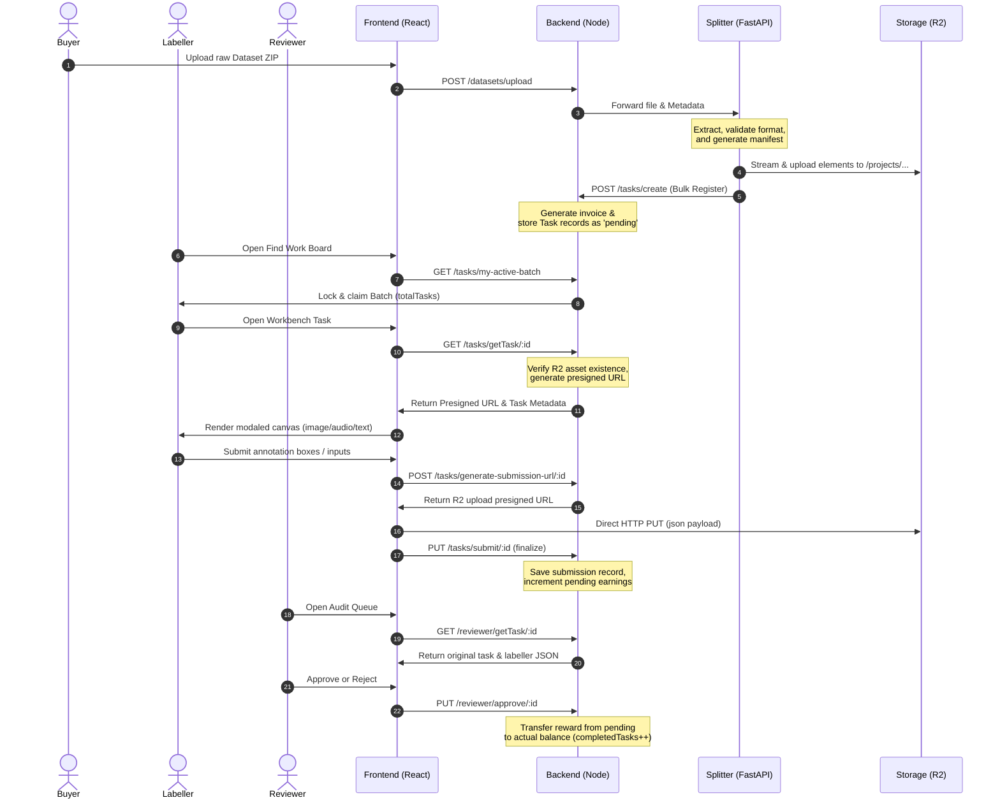

# VeraLabel Ecosystem Architecture & Workflow Guide 🌐

This document provides a comprehensive blueprint of the entire **VeraLabel** ecosystem, detailing how the different systems connect, the flow of data, and the execution lifecycle of data labeling missions.

---

## 📐 Overall System Architecture

The VeraLabel platform is built using a decoupled, multi-modal architecture that separates heavy data processing, database orchestration, edge storage, and human-in-the-loop (HITL) labeling interfaces.

---

## 🧩 Component Directory & Responsibilities

### 1. Frontend Client (`veralabel-frontend`)
* **Tech Stack**: React, TypeScript, Vite, Tailwind CSS, Zustand.
* **Role**: The dashboard interface for buyers, labellers, and reviewers.
* **Core Modalities**:
  - **Visual Workbench (`ImageStage.tsx`)**: Fully interactive canvas supporting zoom, pan, and strict category-bound Bounding Box drawing.
  - **Audio Workbench (`AudioStage.tsx`)**: Renders audio streams with waveform controls and transcription metadata tracking.
  - **NLP Workbench (`TextStage.tsx`)**: Prompts/responses renderers for semantic categorization.
  - **RLHF Preference Stage (`RLHF.tsx`)**: Dual output rank comparison, dimensional scoring grids, and text rationale requirements.

### 2. Main Backend Coordinator (`veralabel-backend`)
* **Tech Stack**: Node.js, Express, MongoDB (Mongoose), Nodemailer, Paystack.
* **Role**: Central state machine. Manages user registration, role promotion, batch locking/claim permissions, task assignments, invoice generation, and mailing alerts.
* **Storage Gateway**: Generates secure pre-signed URLs (15-min TTL) for direct client upload to Cloudflare R2, bypassing Node server memory limits for speed and efficiency.

### 3. High-Performance Splitter (`veralabel-splitter`)
* **Tech Stack**: Python, FastAPI, Docker, `aiohttp`.
* **Role**: CPU-heavy dataset processing. Unpacks ZIP files, reads CSV/JSONL records, builds dataset manifests, performs deterministic hashing, uploads assets to R2 in parallel, and calls the Node.js API to register tasks.
* **Supported Splitters**:
  - `media_splitter.py`: Handles images and video segmentation.
  - `audio_splitter.py`: Splices and formats audio files.
  - `rlhf_splitter.py`: Normalizes dual responses and prompt alignments.
  - `text_splitter.py`: Processes line-by-line NLP content.

### 4. Serverless Edge Worker (`dataset-splitter-worker`)
* **Tech Stack**: Cloudflare Workers (JavaScript), WHATWG Streams API, Web Crypto API.
* **Role**: High-speed edge file routing. Intercepts files, verifies webhook signatures with `X-Vera-Signature`, splits stream packets without exceeding the worker 128MB memory limit, and synchronizes telemetry metadata with the main backend.

### 5. Cloudflare R2 Storage Node
* **Tech Stack**: S3-compatible Object Storage.
* **Role**: Houses all raw data assets (within `/projects/{projectId}/{datasetId}/*`) and stores finalized JSON annotation records uploaded by labellers.

---

## 🔄 End-to-End Data Workflow

The life of a dataset in the VeraLabel ecosystem follows this standard sequence:

---

## 🔒 Security & Performance Guidelines

1. **Deterministic Hashing**:
   - The edge workers and Python splitters hash files using SHA-256 to create scores between 0 and 99.
   - **Train**: Scores 0-79 (80%)
   - **Validation**: Scores 80-89 (10%)
   - **Test**: Scores 90-99 (10%)
   This prevents data leakage across training runs because identical data items always hash to the same bucket.
2. **Direct R2 Uploads**:
   - Clients never send raw annotations through the Node.js server. Instead, they obtain a pre-signed PUT URL and upload directly to Cloudflare R2.
3. **Session Lock-Outs**:
   - Batch claims expire after a rolling 4-hour allocation window. If the labeller does not complete the batch in time, the session is invalidated, and tasks are returned to the public registry.
